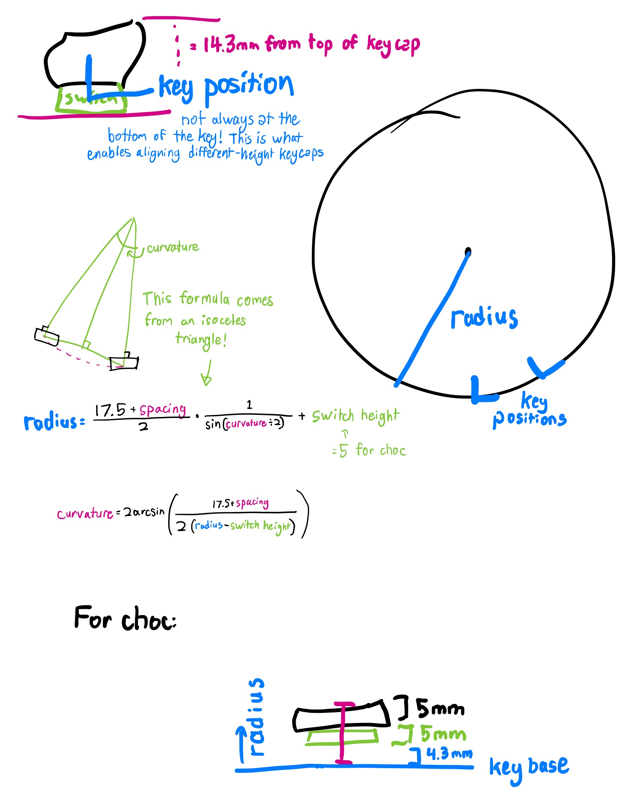

# Expert Mode

Expert Mode in Cosmos is designed to give you full control over the way keys are laid out. It also gives you low-level control over much of Cosmos's functionality, allowing you to build your own keyboard layout generators on top of the software without needing to clone the repository.

Expert Mode is programmed using the [TypeScript](https://www.typescriptlang.org/) programming language, but for all practical purposes you only need to know JavaScript. Very little of TypeScript's features are used; instead it mostly serves to warn you if you spelled a property wrong.

## Matrix Layout

{ width=350 .center .pad }

Most keys are laid out using the `placeOnMatrix` function, looking something like this:

```typescript
new Trsf()
  .placeOnMatrix({
    curvatureOfColumn: 15, // Degree of curvature through a column (vertically)
    curvatureOfRow: 5,     // Degree of curvature through a row (horizontally)
    spacingOfRows: 20.5,   // How far apart each row is (vertically)
    spacingOfColumns: 21.5 // How far apart each column is (horizontally)
    row: -1                // Key position (vertical)
    column: -2.5,          // Key position (horizontal)
  })
```

!!! tip "Spread Syntax"

    The auto-generated Expert Mode code uses the [spread syntax](https://developer.mozilla.org/en-US/docs/Web/JavaScript/Reference/Operators/Spread_syntax#spread_in_object_literals) in JavaScript to tidy up the calls to `placeOnMatrix`. Wherever you see `...curvature` in the code, the contents of the `curvature` variable are substituted into the call to `placeOnMatrix`. This allows all keys to reference a common curvature setting.

!!! tip "Alternative Naming"

    The `spacingOfRows` option is equivalent to using `spacingInColumns`, and `spacingOfColumns` is equivalent to `spacingInRows`. The first set of names are used by default, but feel free to use whichever makes most sense to you!

This function places the key on a curved matrix, at a position determined by `row` and `column`. If the row and column curvatures are set to zero, keys will be spaced apart by exactly the specified spacing (which is in millimeters).

## Sphere Layout

{ width=300 .center .pad }

An alternative to the matrix layout is to place keys in a rotated fashion, which is useful for thumb clusters.

```typescript
new Trsf()
  .placeOnSphere({
    curvature: -10, // How much the sphere curves
    spacing: 18.75  // How far apart each row is
    angle: -40,     // Measured from the horizontal
    row: 2          // Number of spacings away from the center
  })
```

This lays keys out on a series of rows of concentric circles. The `spacing` argument determines how far apart keys lie on adjacent rows, and you can also make the keys tilt the further they are away from the center of the circle by adjusting the `curvature`. The `angle` argument determines where on the circle the key is placed.

### An Example

The code below creates an unconventional keyboard laid out on a sphere. You'll injure yourself if you try to use this keyboard in real life, but you can play around with it virtually [in the generator](https://ryanis.cool/cosmos-beta/#expert:eJxtVE2P2jAQvfMrplyALmShLVWVtqftpaqqrQo3xME4k8TF2K7tLLAr/nvHk/CxUiUknDdvZt7kjSOtCRGsi4oOOTy2B/gKLz2AvdB6WSu5NRgo+GHcYYva26ZQpsphyhhubmgMBelx/90USiJBq/UFWx4d5tDnMygT0Mf+JbhQzyn48/0VerCNieiDMtscom8wRai9KbDI4eWUHqU1BmW0PgfTaP0KIg14yGEyS+hOSW8pFL3VGm/oTyRDSaEfNAovjCQV04xTZEIWSUm49g81ak3dIbbTbERQsj8GrVwOpdAB4dQ79Xr39/ANS2UQYo2gMaZJIFrYIDgtJBZgDaCQNY2070k2g07JgNXg+SCfNmY3GMNAhKKs6j9bnR7+7kntsVHWDdZdzhaPJO8HHlfrlLrm1g8p5BsZuXuiwF7FGkrrQVvrQi+dhiQLPGVNP9PfF26faTRVrAm4uxvxKlyYqmWqjrny6wtZnckA1H3Z9hwEsGUZKLP0dsdKJCZHmdeqb4FUOJvDBIbqfvi69mQ2GjE/DZG5JtTDtg+cHdgdJht+vbw5HVUKl0xy3pZKJ9ahEOQS1c5hPu78yM9zrNQaTudsqZvAwT7ZV5Frl7oiOFqsHGZnwNmg0q2hbaKVXvpQDkddCCBjmx/NwtXo8aKaWzT+ScTGk7AZqaFX9kuLIwhe7tYpfltnWtqbndgitykwqMqENzf1ghOS7+TsUzYf3wSEqdL00/HZFm+jSIqhFs4hXXdR0qx74Ytwk8avyd+9u0Cnm7Ei3ZKgRcThajajyum3HvEQ5M514Wzzf+O5COvA4fwjvO1iXGHhhAFB40ahaXmA4gVWHrFVxzL4euHBWR8pWIpGR169LMu6jxl/mLwK8TeG+OhVpcz1vidt497pHysDiKE=).

{ width=600 .center .pad }

```typescript
// Define the letters to be placed on each row
const rows = ['zxcvbnm', 'asdfghjkl', 'qwertyuiop']
const keys: Key[] = []

// Construct the keys with for loops
for (let r = 0; r < rows.length; r++) {
  for (let i = 0; i < rows[r].length; i++) {
    // The key's offset from the center
    const center = 0.5 - (i / (rows[r].length - 1))
    keys.push({
      type: 'mx-better',
      keycap: { profile: 'xda', row: 5, letter: rows[r][i] },
      cluster: 'fingers',
      aspect: 1,
      position: new Trsf()
        .placeOnSphere({
          curvature: 15, // Play around with the curvature to make new designs!
          spacing: 18.5,
          angle: 0, // The rotation happens afterwards
          row: r + 2,
        })
        .translate([110, 0, 0]) // Push the keys out from the center
        .rotate(56 * center), // Span a total of 56 degrees
    })
  }
}

export default { ...options, wristRestOrigin: null, keys }
```

## The `Trsf` Class

All positioning in Expert Mode is performed through the `Trsf` class. It allows you to define translations, rotations, and layout operations.

At a low level, the class represents operates on a 4x4 [transformation matrix](https://learnopengl.com/Getting-started/Transformations). All operations are stored in a queue and evaluated once the generator can determine whether it is laying out keys in a 2D or 3D environment.

The various operations that can be performed on a `Trsf` are as follow:

- `translate`: Moves the object by some amount.
- `rotate`: Rotates the object around a point.
- `rotateTowards`: Rotates the object towards some orientation.
- `rotateToVertical`: Rotates the object to face upwards.
- `mirror`: Mirrors the position of an object about an axis while preserving orientation.
- `transformBy`: Applies a transformation object to this object. This is equivalent to matrix multiplication.
- `translateBy`: Applies only the translational part of a transformation object to this object.
- `placeOnMatrix` and `placeOnSphere`: Positions the object on a matrix/sphere.

## How Keys are Positioned

Until I write some better documentation here, please accept this image that uses Choc as an example.

{ width=75% .center }
