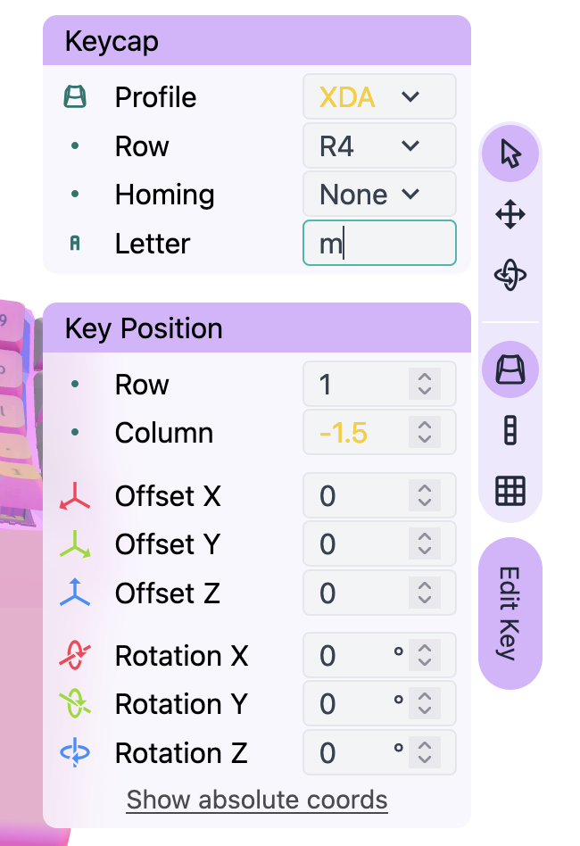
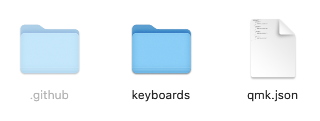
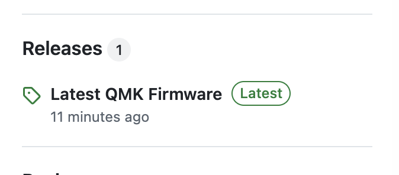
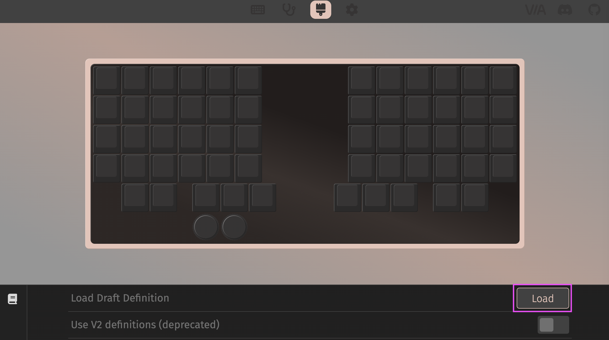

# Firmware Autogen


If you're using the [Lemon Microcontrollers](https://ryanis.cool/cosmos/lemon), Cosmos can automatically generate your keyboard firmware. For the Wired Lemon, Cosmos will generate [QMK](https://qmk.fm/) firmware. For the Wireless Lemon, it will generate [ZMK](https://zmk.dev/) firmware. These are the most popular and feature-complete firmware for wired and wireless keyboards respectively.

Keyboards created in Cosmos need custom firmware because every keyboard firmware must be adjusted for the number of keys you chose to use, how they're wired, how they're mapped to letters/actions, and what extra peripherals you are using (like trackballs, encoders, etc). Typically you will adapt a configuration for QMK or ZMK to your keyboard then compile the firmware and configuration together, either by installing the toolchains yourself or using [GitHub Actions](https://github.com/features/actions) to compile in the cloud.

Despite the fact that some peripherals are not yet supported (you can track the implementation status at [Are we Programming yet](https://ryanis.cool/cosmos/areweprogrammingyet/)), Cosmos is still the easiest starting point for creating firmware for your board. You can use Cosmos to to generate what it can, start typing on your keyboard, and refer to the documentation and online examples to configure the remaining peripherals. It's like buying a car with a speaker system that still needs to be installed, versus piecing together an engine, drivetrain, chasis, etc.

!!!info "Support for More Microcontrollers"

    Right now only the Lemon microcontrollers are supported because the VIK and flex PCB connectors ensure there is only one way to connect everything to your microcontroller pins, which greatly simplifies the generation process.

    The priority right now is to make this process as dead simple as possible. There's still a lot of work to tackle, and if you're interested you can read the roadmap on the [PeaMK repository](https://github.com/rianadon/peaMK). Only after this is completed will the focus be expanding to other microcontrollers. However, you are more than welcome to fork Cosmos and adapt the code to the microcontroller you're using. Pull requests are always welcome :)

<div class="grid cards" markdown>

- **Lemon Wired**

      ---

      [:octicons-arrow-right-24: Documentation](pcbs/lemon-wired.md)

- **Lemon Wireless**

      ---

      [:octicons-arrow-right-24: Documentation](pcbs/lemon-wireless.md)

</div>

## Key Labeling

Cosmos will by default label keys according to the QWERTY layout. These labels will be used in the firmware to assign keys. If you use a different layout or have added keys beyond the typical QWERTY setup, you can change key labels by clicking a key in the 3D view, cliking "Edit Key", then changing the "Letter" field.

{ width=250 .center }

If you are editing the upper keys jointly, you will only be able to change the labels on the right split. The left split will use the QWERTY layout to derive its labels from the right split. If you aren't using QWERTY, you will need to click "Edit Separately".

Cosmos supports a few different options for labeling keys:

- Letters (`a–z`, `A–Z`). The letter case in Cosmos doesn't matter.
- Numbers (`0-9`)
- Function keys (`F1–F12`)
- Special characters (`-`, `:`, `<`, `~`, `@`, `!`, etc.)
- Names of non-character keys (`esc`, `escape`, `enter`, `tab`, `bspc`, `backspace`, etc.)
- QMK only: Verbatim keys (`KC_X`, `QK_BOOT`, `MO(1)`, `MT(MOD_LSFT, KC_UP)`, etc.)
- ZMK only: Verbatim behaviors (`&kp X`, `&bootloader`, `&mo 1`, `&mt LSFT UP`)

If a key label isn't in one of these formats, it will be replaced with the space key.

## QMK (Wired) Generation

I recommend using GitHub Actions to build your firmware since it requires installing no software and therefore is much faster to set up. However, you can also choose to build the firmware locally. Once you spend the time to set up the local environment, local builds will be much faster.

When you download the firmware from Cosmos, you'll get a zipped folder with a few directories. Here's what you should see after unzipping and turning on hidden folders in Mac/Linux (in Windows you don't need to turn on anything):

{width=321 .center}

The actual firmware code is within the `keyboards/<your-keyboard>` folder. The `.github` and `qmk.json` files are generated to help you set up GitHub Actions.

### Building

#### GitHub Actions Build

1. [Create a new repository on GitHub.](https://docs.github.com/en/repositories/creating-and-managing-repositories/creating-a-new-repository)
2. [Clone the repository](https://docs.github.com/en/repositories/creating-and-managing-repositories/cloning-a-repository), copy the files shown above (including `.github`) into the repository, and [commit](https://github.com/git-guides/git-commit) and [push](https://github.com/git-guides/git-push). If you've never used GitHub before, my recommendation is to use the GitHub web editor by pressing ++period++ when on the repository page or replacing the `.com` in the URL with `.dev`. You can drag and drop these folders into the file explorerer then commit & push online.
3. On the repository in GitHub, you'll see "Latest QMK Firmware" listed under "Releases" on the right hand side. Click the release name then download the appropriate files. The UF2 files with `via` in their name support VIA, whereas those without do not support VIA.

   { width=337 .center }
4. Enter bootloader mode on the microcontroller and copy the `.uf2` file to the `RPI-RP2` drive. Make sure to flash both halves of the split keyboard.

!!!tip "How is this working?"

    The GitHub action is set up to use the [QMK External Userspace](https://docs.qmk.fm/newbs_external_userspace) feature. Userspaces are meant for you to be able to add new keymaps and configurations for existing keyboards. However, every keyboard generated with Cosmos is a new keyboard, so the two don't work great together out of the box. The Actions workflow generated by Cosmos copies your keyboard configuration into the QMK repository (just as the below local build instructions describe) to sidestep this limitation.

#### Local Toolchain Build

Unfortunately, [QMK Toolbox](https://qmk.fm/toolbox) hasn't been updated to support flashing newer chips like the RP2040. Your best bet to compile firmware is to either use QMK [through Docker](https://docs.qmk.fm/getting_started_docker) or [install the QMK tools directly](https://docs.qmk.fm/newbs_getting_started). If you use docker, you don't need to worry about USB setup for flashing your microcontroller because the RP2040 uses UF2 files. Once you put the microcontroller into bootloader mode, you'll be able to drag the UF2 file into the virtual flash drive that appears.

Once you've downloaded the QMK repository, make a new folder for your boards. I like to create a `cosmos` directory under the `keyboards` folder and put my firmware inside `keyboards/cosmos`. Unzip the firmware file Cosmos generated for you and drag the folder inside `keyboards/` into the new folder you just made. The directory structure should look something like:

```
keyboards/cosmos
└── cosmotyl
    ├── config.h
    ├── keyboard.json
    ├── keymaps
    │   ├── default
    │   │   └── keymap.c
    │   └── via
    │       ├── keymap.c
    │       └── rules.mk
    ├── rules.mk
    └── vik...
```

If you placed the config somewhere other than `keyboards/cosmos` (i.e. you used a different folder name), make sure to change the `#include` statements in `config.h`.

If you installed QMK directly, use

```
qmk flash -c -kb cosmos/cosmotyl -km via -bl uf2-split-left
qmk flash -c -kb cosmos/cosmotyl -km via -bl uf2-split-right
```

to flash the left and right sides. If you used docker then run

```
util/docker_build.sh cosmos/cosmotyl:via:uf2-split-left
util/docker_build.sh cosmos/cosmotyl:via:uf2-split-right
```

and make sure to copy out the `.uf2` file after each command.

### Setting Up Via

This step is quite easy. Download the Via config from Cosmos. Then [navigate to Via](https://usevia.app/) and click the settings gear. Make sure that "Show Design tab" is enabled.

{ width=500 .center }

Then open the design tab and click **Load** next to "Load Draft Definition".

{ width=600 .center }

Select the JSON file you downloaded, and if all goes well your keyboard design will now be imported into Via. You can preview it by selecting it next to "Show Keyboard Definition".

Now plug in your keyboard, and you'll be able to change the key assignments!

## ZMK (Wireless) Generation

### Hardware Limitations

- For the Cirque trackpad, only SPI communication is supported! This is how they come out of the box. Don't listen to guides that tell you to remove R1. SPI is what you want to use because it is faster than I2C.
- Trackballs and trackpads are only officially supported (for now) on the central side. You can use a cirque trackpad on the peripheral side by changing `vik_cirque_spi` in your `build.yaml` to `vik_cirque_spi_split`. There's no such thing for the pmw3610 yet. Dual trackballs/trackpads are not yet supported either.

### Building

You can either follow ZMK's instruction to set up a [Local Toolchain](https://zmk.dev/docs/development/local-toolchain/setup) or use GitHub Actions to build your firmware. I recommend GitHub Actions since it requires installing no software and therefore is much faster to set up.

When you download the firmware from Cosmos, you'll get a zipped folder with a few directories. Here's what you should see after unzipping and turning on hidden folders in Mac/Linux (in Windows you don't need to turn on anything):

{width=550 .center}

#### GitHub Actions Build

1. [Create a new repository on GitHub.](https://docs.github.com/en/repositories/creating-and-managing-repositories/creating-a-new-repository)
2. [Clone the repository](https://docs.github.com/en/repositories/creating-and-managing-repositories/cloning-a-repository), copy the files shown above (including `.github`) into the repository, and [commit](https://github.com/git-guides/git-commit) and [push](https://github.com/git-guides/git-push). If you've never used GitHub before, my recommendation is to use the GitHub web editor by pressing ++period++ when on the repository page or replacing the `.com` in the URL with `.dev`. You can drag and drop these folders into the file explorerer then commit & push online.
3. Click the "Actions" tab on GitHub, click the top build, and you'll be able to download the firmware under "Artifacts" once the build completes. [ZMK has a detailed guide on this](https://zmk.dev/docs/user-setup#download-the-archive).
4. Enter bootloader mode on the microcontroller and copy the `.uf2` file to the `LEMONBOOT` drive. Make sure to flash both halves of the split keyboard.

#### Local Toolchain Build

If you're using the local toolchain, copy the contents of `boards/shields` (there should be a single folder named after your keyboard) into ZMK's `app/boards/shields` directory. The command you'll use to build varies based on what modules you're using. The nice thing about GitHub actions is it automatically fetches and sets up these modules. If you're building locally, it's expected you can figure this stuff out on your own.

Here's how I build a keyboard with usb logging enabled:

```console
west build -d build/right -b cosmos_lemon_wireless -S zmk-usb-logging -- \
  -DSHIELD="cosmotyl_right" -DZMK_EXTRA_MODULES="/path/to/zmk-fingerpunch-vik"
```

and one with a PMW3610 trackball:

```console
west build -d build/right -b cosmos_lemon_wireless -S zmk-usb-logging -- \
  -DSHIELD="cosmotyl_right vik_pmw3610" \
  -DZMK_EXTRA_MODULES="/path/to/zmk-pmw3610-driver;/path/to/zmk-fingerpunch-vik"
```

You'll find the UF2 file under `build/right`, which you can then copy to the microcontroller.

Those extra modules come from these repositories, which you will need to clone onto your computer:

- [zmk-fingerpunch-vik](https://github.com/rianadon/zmk-fingerpunch-vik/)
- [zmk-pmw3610-driver](https://github.com/sadekbaroudi/zmk-pmw3610-driver)
- [cirque-input-module](https://github.com/petejohanson/cirque-input-module)
