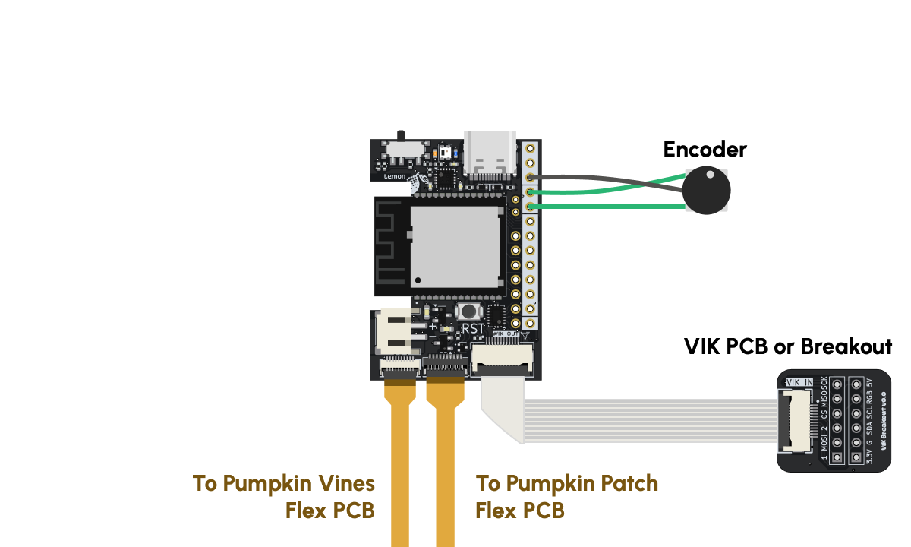
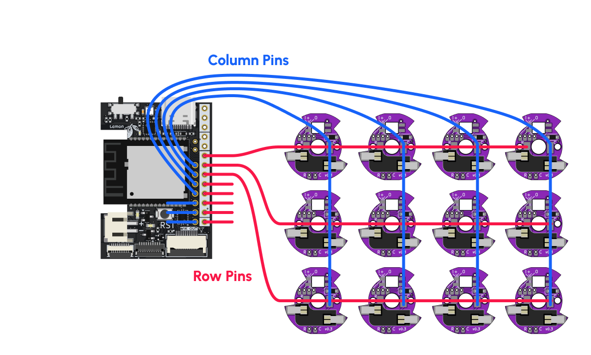
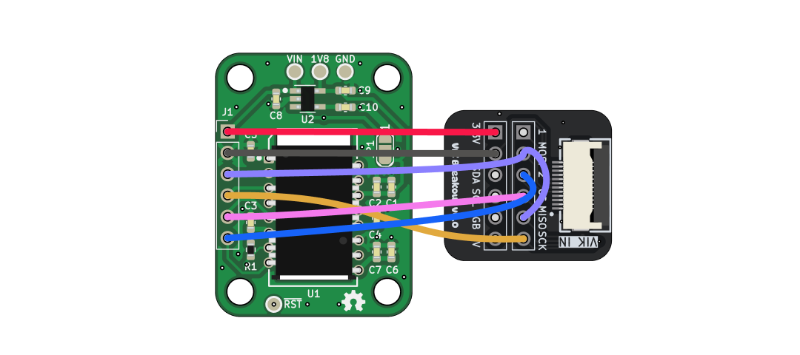
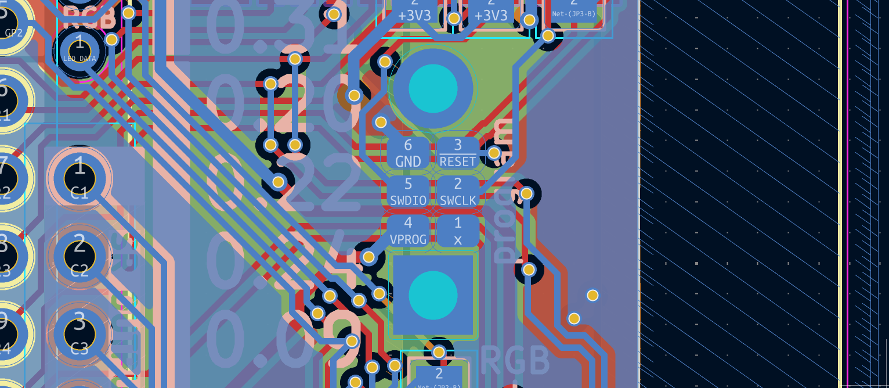
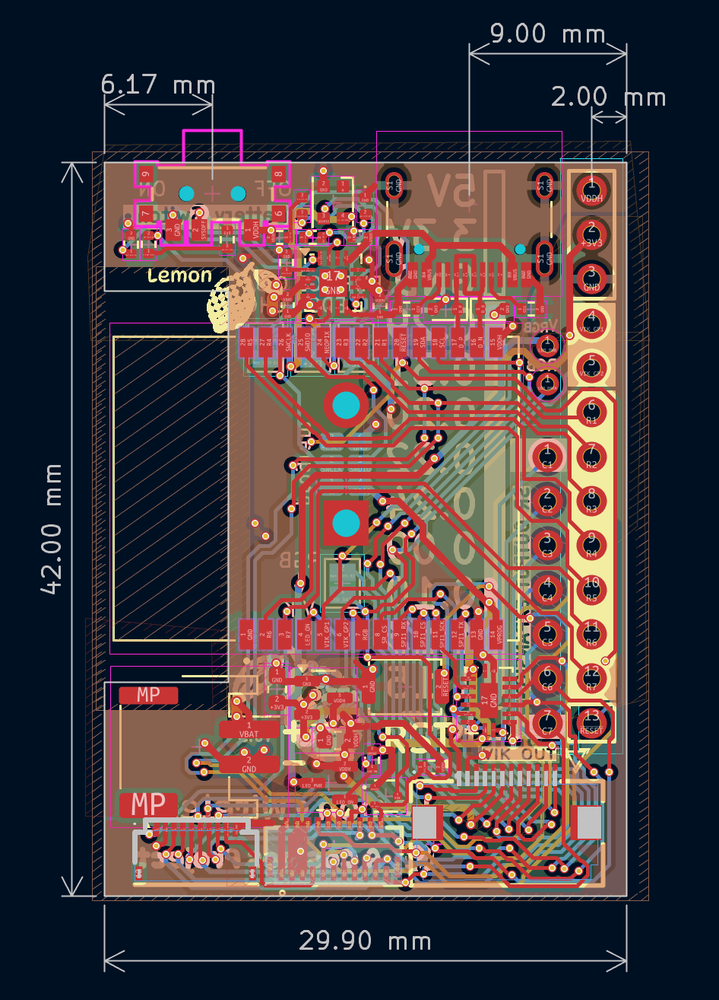

# Lemon Wireless

The Lemon Wireless is an nRF52840-based microcontroller for split keyboards with a USB-C port, power switch, JST battery connector, a VIK connector, and two FPC connectors for connecting column-flex PCBs. If you use column-flex PCBs and VIK-compatible peripherals, it's possible to build a wireless split keyboard without soldering any wires!

If you haven't already, I suggest you check out the [Lemon Landing page](https://ryanis.cool/cosmos/lemon) to learn more.

--8<-- "docs/docs/lemon/.shared/info.md"

## Pinout

Go to the [landing page](https://ryanis.cool/cosmos/lemon) :)

## Onboard LEDs

There are three LEDs on the top of the Lemon Wireless:

- The orange LED indicates the battery is charging. It will also light up if the battery switch is off but USB is connected.
- The RGB LED in the center indicates bootloader status. I'll light up in bootloader mode and change color as you're uploading.
- The blue LED is the power indicator. It will be on if your microcontroller has power.

For those trying to eek out every last minute of power, you can disable the latter two LEDs by cutting the solder jumpers on the rear of the board under "PWR,RGB LEDS". The one closest to "PWR" cuts the blue power LED, while the other one cuts power to the RGB LED and will save you about 1mA of current while idle.

The downside of cutting the LEDs is it's harder to know what's going on, so only cut them once you're confident you know how to use the microcontroller.

## Power

The Lemon Wireless can run on both USB power and a 4.2/3.7V Lithium Polymer (LiPo/LiPoly) or Lithium Ion (LiIon) rechargable battery. If you connect both at the same time, the microcontroller will draw from USB power while charging the battery.

!!! warning

    Connecting a battery with incorrect JST connector polarity can permanently damage the board. There's no standard for the polarity, so batteries ordered from places like Amazon may be wired incorrectly. You can fix a reversed connector by [removing and rearranging](https://www.youtube.com/watch?v=0G7iIwfuaJ8) the crimped leads in the JST housing. Then double check the wire coloring matches the silkscreen on the board (red goes to +, black goes to -).

    To avoid this risk entirely, it's safest to buy [batteries from Adafruit](https://www.adafruit.com/category/574). Their batteries are correctly wired and buying from them helps support their open-source contributions—such as the bootloader used by this board.

These are the only two kinds of batteries supported. Plugging in a higher voltage battery (e.g. a multicell one like 7.4V) or alkaline/nonrechargeable batteries will damage the board.

On the rear of the microcontroller there is a "0.5A CHG" solder jumper. By default the microcontroller will charge the battery with 100mA, but if you short the jumper it will charge at 500mA. Most batteries will come with a "C" rating that tells you how much current is safe to charge them with. A 400mAh battery that charges at 1C will use 400mA to charge. The same battery charging at 0.5C needs 200mA.

I recommend only soldering this jumper shut only if you're using a battery with more than 500mAh capacity so that you're always charging at less than 1C. Charging at less than 0.4C may prolong the life of the battery.

## Wiring

### Recommended Use

I recommend using column-flex PCBs to wire your keys, not only because they are easy to connect via the FPC connectors on the bottom of the microcontroller, but also because you will save yourself hours of wiring together keys. This example shows the two I sell, the Pumpkin Patch (for upper keys & some thumb keys) and Pumpkin Vine (for the further away thumb keys), used to wire the keys as well as an encoder attached to the VIK pins.

{width=600 .center}

Unlike the Lemon Wired, there are no spare pins on the Lemon Wireless! Everything is going to a connector or used for some internal function. If whatever you have connected through VIK does not use the I/O pins, you can connect the encoder as I've shown. Otherwise, you'll need to use spare row/column pins.

???tip "Using More Than One Encoder?"

    You're crazy. Hahaha.

    If you need more encoders, you'll have to steal even more pins away. Chances are you're not using *everything*, so some potential pins you can grab are, in order of ease of use:

    - Row and Column Pins: Unless you're using a 7x7 matrix, you'll probably have a few unused ones. Note that the Pumpkin Patch PCB uses up to R1–R6 and C1–C7, whereas the Pumpkin Vines PCB uses R7 and up to C1–C7.
    - All the VIK pins. If you have no reason to use VIK but need many, many more GPIOs, you can use the VIK breakout or a 12pin/0.5mm FPC breakout to access these pins. This gives you 8 more digital I/Os including GP1 and GP2. Don't use P0.26 (RGB* in the wiring diagram) because it is level shifted up to 5V!

### Handwiring / Using Plum Twists

If you're forgoing flex PCBs, here's how you should solder the row and column wires to the microcontroller.

{width=600 .center}

Chances are, your keyboard layout is not a rectangle. In that case make sure you have 7 columns and 7 rows max and that every key is assigned to a unique pair of row and column pins. It doesn't matter if you have 7 keys in one column and 3 in another.

By following my convention of which pins are for the rows and which are for the columns, you'll be able to use tools I develop like [PeaMK](https://github.com/rianadon/peaMK) to more quickly set up your firmware. I also assume you're wiring this way in the ZMK Tips section.

### Connecting RGB LED Strips

If you're handwiring and would like some backlighting on the keys but don't feel like spending another 3 hours soldering, RGB LED strips are a quick and easy alternative. I usually opt for the WS2812B ones, but ZMK [supports a few WS28xx, SK68xx, APA102, and LPD880x variants](https://zmk.dev/docs/features/lighting).

You will solder to the GND pin on the outermost column of pins and the two small pads in the innermost column.

{width=600 .center}

Once soldered, you can coil the LED strip up in the base of the keyboard. If you laser cut a transparent base plate or use transparent filament, you'll get really cool effects.

### VIK Breakout and Trackball

There are sadly no trackball PCBs with VIK connectors on the market. I'm working with TheBigSkree to fix this, but for now you will need augment one with a VIK breakout.

This example uses the [PMW3610 PCB](https://github.com/siderakb/pmw3610-pcb) that Skree [sells](https://skree.us/products/zmk-compatible-pmw3610-board?ref=cosmos). I recommend connecting it to the breakout with short cables so most of the distance is covered by the FPC connector. Your wiring will look much neater for it.

{width=600 .center}

<center class="pinout" markdown>

| Trackball PCB | VIK Breakout  |
| :------------ | :------------ |
| VIN           | 3.3V          |
| GND           | GND           |
| SDIO          | MOSI and MISO |
| SCLK          | SCK           |
| nCS           | CS            |
| Mot           | 2             |

</center>

You will need to short together MISO and MOSI as I show in the illustration above. As long as you have just the trackball (and the internal shift register on the Lemon Wireless) on the SPI bus, it is okay to short these. It is also okay to put both the trackball and a display on the same bus as long as your display uses MOSI only (if there's no MISO pin on your display, you'll be ok).

The proper way to put the PMW3610 on the bus while maintaining compatibility with 4-wire SPI devices (i.e. things that use both MISO and MOSI) is to use a tri-state buffer in between SDIO and MISO or between SDIO and MOSI. I will be doing this on future VIK-enabled PMW3610 boards.

--8<-- "docs/docs/lemon/.shared/vik-wiring.md"

## Programming

To enter bootloader mode, press the RST button twice in quick succession. You'll see a removable drive called LEMONBOOT pop up on your computer. Drag your UF2 file into this folder, then wait for the microcontroller to reset itself and remove the drive.

!!!tip "MacOS Warnings"

    If you're uploading firmware from a Mac, you may get warnings saying that your computer couldn't sucessfully write to the drive or reminding you to eject the drive. This is normal and expected.

Once your microcontroller is sealed away in your keyboard, you won't be able to use the RST button anymore. There are three ways of getting around this in ZMK:

- (My Preference) Set up Bootmagic. This is not in mainline ZMK yet, but I merged the relevant PR into my fork. If you hold down a certain key while plugging your keyboard in, the microcontroller will enter bootloader mode. You can configure which key this is per split side.
- Wire a physical reset button between the reset pin on the bottom right of the Lemon Wireless and ground. You can use the custom connector option in Cosmos to make a hole for the button. You can double tap this one to enter bootloader mode.
- Don't add a bottom plate (or take it off), You'll be able to access the GND and RST pins through the channel in the Cosmos board holder. If you short these with tweezers or a jumper twice in quick succession then you will be in bootloader mode.

## ZMK Example

The best example of using ZMK on the Lemon microcontroller will for now probably be the ZMK implementation of my [peaMK](https://github.com/rianadon/peaMK/tree/main/zmk) software. Currently, all this program does is print the matrix position of a key you press, but you can disable this feature by editing `boards/shields/peamk/peamk.keymap`. There are a few noteworthy aspects to this program:

- The structure is the same as a ZMK userspace repository, so you can follow the ZMK install instructions then copy these files over to your GitHub repository.
  - It uses Sadek Baroudi's [VIK module](https://github.com/sadekbaroudi/zmk-fingerpunch-vik) which makes configuring VIK modules very easy. For example, to add a Cirque trackpad you only need to add this to your `build.yml`:
  ```yaml
  ---
  include:
    - board: cosmos_lemon_wireless
      shield: <YOUR_KEYBOARD> vik_cirque_spi
  ```

### ZMK Tips

These are all taken care of if you autogenerate your firmware with Cosmos, but they are good to know if you are starting from scratch or adapting someone else's firmware.

1. I haven't upstreamed support for the Lemon Wireless to ZMK yet, so you'll need to use my branch of the firmware. You can do this by modifying your `west.yml` to read:

   ```yaml
   manifest:
     remotes:
       - name: zmkfirmware
         url-base: https://github.com/zmkfirmware
       - name: rianadon
         url-base: https://github.com/rianadon
     projects:
       - name: zmk
         remote: rianadon
         revision: main
         import: app/west.yml
     self:
       path: config
       import: deps.yml
   ```

   Once I upstream the changes you can change `#!yaml remote: rianadon` to `#!yaml remote: zmkfirmware`.

2. Your `build.yaml` should specify `#!yaml board: cosmos_lemon_wireless`. If you are building from the command line, use `west build -b cosmos_lemon_wireless`...

3. You MUST use `diode-direction = "col2row"` when configuring `kscan`, even if your diodes are connected in ROW2COL fashion. This is because `diode-direction` secretly configures whether the columns are the outputs or inputs when scanning. Because the Lemon Wireless uses a shift register to drive the columns, they can only be outputs. To use ROW2COL, use `diode-direction = "col2row"` together with row GPIOs configured as `GPIO_ACTIVE_LOW | GPIO_PULL_UP` and column GPIOS configured as `GPIO_ACTIVE_LOW`. See [this example for ROW2COL](https://github.com/rianadon/peaMK/blob/main/zmk/boards/shields/peamk/peamk_r2c.dtsi) and [this example for COL2ROW](https://github.com/rianadon/peaMK/blob/main/zmk/boards/shields/peamk/peamk_c2r.dtsi)

## Arduino Core

I haven't contributed this board upstream yet since I don't know how popular this option is going to be. Therefore, if you do program the Lemon with Arduino then please tell me so I can prioritize this!

??? note "Expand Arduino Instructions (Caution: Not Easy)"

    You will need to install Adafruit's nRF52 core via git by following the instructions [here](https://learn.adafruit.com/introducing-the-adafruit-nrf52840-feather/arduino-bsp-setup), all the way down to and including **Advanced Option: Manually Install the BSP via 'git'**. Then, open the cloned `Adafruit_nRF52_Arduino` folder and add these lines to the end of `boards.txt`:

    ``` title="boards.txt"
    # -----------------------------------
    # Cosmos Lemon Wireless
    # -----------------------------------
    cosmos_lemon_wireless.name=Cosmos Lemon Wireless

    cosmos_lemon_wireless.vid.0=0x1915
    cosmos_lemon_wireless.pid.0=0x6c77

    # Upload
    cosmos_lemon_wireless.bootloader.tool=bootburn
    cosmos_lemon_wireless.upload.tool=nrfutil
    cosmos_lemon_wireless.upload.protocol=nrfutil
    cosmos_lemon_wireless.upload.use_1200bps_touch=true
    cosmos_lemon_wireless.upload.wait_for_upload_port=true
    cosmos_lemon_wireless.upload.maximum_size=815104
    cosmos_lemon_wireless.upload.maximum_data_size=237568

    # Build
    cosmos_lemon_wireless.build.mcu=cortex-m4
    cosmos_lemon_wireless.build.f_cpu=64000000
    cosmos_lemon_wireless.build.board=NRF52840_FEATHER
    cosmos_lemon_wireless.build.core=nRF5
    cosmos_lemon_wireless.build.variant=cosmos_lemon_wireless
    cosmos_lemon_wireless.build.usb_manufacturer="Cosmos"
    cosmos_lemon_wireless.build.usb_product="Lemon Wireless"
    cosmos_lemon_wireless.build.extra_flags=-DNRF52840_XXAA {build.flags.usb}
    cosmos_lemon_wireless.build.ldscript=nrf52840_s140_v6.ld
    cosmos_lemon_wireless.build.openocdscript=scripts/openocd/daplink_nrf52.cfg
    cosmos_lemon_wireless.build.vid=0x1915
    cosmos_lemon_wireless.build.pid=0x6c77

    # Menu: SoftDevice
    cosmos_lemon_wireless.menu.softdevice.s140v6=S140 6.1.1
    cosmos_lemon_wireless.menu.softdevice.s140v6.build.sd_name=s140
    cosmos_lemon_wireless.menu.softdevice.s140v6.build.sd_version=6.1.1
    cosmos_lemon_wireless.menu.softdevice.s140v6.build.sd_fwid=0x00B6

    # Menu: Debug Level
    cosmos_lemon_wireless.menu.debug.l0=Level 0 (Release)
    cosmos_lemon_wireless.menu.debug.l0.build.debug_flags=-DCFG_DEBUG=0
    cosmos_lemon_wireless.menu.debug.l1=Level 1 (Error Message)
    cosmos_lemon_wireless.menu.debug.l1.build.debug_flags=-DCFG_DEBUG=1
    cosmos_lemon_wireless.menu.debug.l2=Level 2 (Full Debug)
    cosmos_lemon_wireless.menu.debug.l2.build.debug_flags=-DCFG_DEBUG=2
    cosmos_lemon_wireless.menu.debug.l3=Level 3 (Segger SystemView)
    cosmos_lemon_wireless.menu.debug.l3.build.debug_flags=-DCFG_DEBUG=3
    cosmos_lemon_wireless.menu.debug.l3.build.sysview_flags=-DCFG_SYSVIEW=1

    # Menu: Debug Port
    cosmos_lemon_wireless.menu.debug_output.serial=Serial
    cosmos_lemon_wireless.menu.debug_output.serial.build.logger_flags=-DCFG_LOGGER=0
    cosmos_lemon_wireless.menu.debug_output.serial1=Serial1
    cosmos_lemon_wireless.menu.debug_output.serial1.build.logger_flags=-DCFG_LOGGER=1 -DCFG_TUSB_DEBUG=CFG_DEBUG
    cosmos_lemon_wireless.menu.debug_output.rtt=Segger RTT
    cosmos_lemon_wireless.menu.debug_output.rtt.build.logger_flags=-DCFG_LOGGER=2 -DCFG_TUSB_DEBUG=CFG_DEBUG -DSEGGER_RTT_MODE_DEFAULT=SEGGER_RTT_MODE_BLOCK_IF_FIFO_FULL
    ```

    There should be a `variants` folder in the same directory as `boards.txt`. Inside the `variants` folder, create a directory called `cosmos_lemon_wireless`. Then add these two files

    ```cpp title="variant.cpp"
    #include "variant.h"
    #include "wiring_constants.h"
    #include "wiring_digital.h"
    #include "nrf.h"

    const uint32_t g_ADigitalPinMap[] =
    {
      (32+13), // D0
      (32+15),
      (2),
      (29),
      (31),
      (26),
      (4),
      (6),
      (8),
      (32+9),
      (12), // D10
      (10),
      (9),
      (32+0), // D13
      (24),
      (22),
      (20),
      (18),
      (15),
      (13), // D19
      (14), // Useless pin
      (17), // useless pin
    };

    void initVariant() { }
    ```
    ```cpp title="variant.h"
    #ifndef _VARIANT_LEMONWIRELESS_
    #define _VARIANT_LEMONWIRELESS_

    /** Master clock frequency */
    #define VARIANT_MCK       (64000000ul)

    #define USE_LFXO      // Board uses 32khz crystal for LF
    // define USE_LFRC    // Board uses RC for LF

    /*----------------------------------------------------------------------------
     *        Headers
     *----------------------------------------------------------------------------*/

    #include "WVariant.h"

    #ifdef __cplusplus
    extern "C"
    {
    #endif // __cplusplus

    // Number of pins defined in PinDescription array
    #define PINS_COUNT           (22)
    #define NUM_DIGITAL_PINS     (22)
    #define NUM_ANALOG_INPUTS    (6) // A6 is used for battery, A7 is analog reference
    #define NUM_ANALOG_OUTPUTS   (0)

    #define LED_STATE_ON 1

    // LEDs
    /* #define PIN_LED1             (3) */
    /* #define PIN_LED2             (4) */
    /* #define PIN_NEOPIXEL_POWER   (34) */
    #define PIN_NEOPIXEL         (13)
    #define NEOPIXEL_NUM         1

    #define PIN_LED1             (20)
    #define PIN_LED2             (21)

    #define LED_BUILTIN          PIN_LED1
    #define LED_CONN             PIN_LED2

    #define LED_RED              PIN_LED1
    #define LED_BLUE             PIN_LED2

    #define ADC_RESOLUTION    14

    // Other pins

    /*
     * Serial interfaces
     */
    #define PIN_SERIAL1_RX       (14)
    #define PIN_SERIAL1_TX       (15)

    /*
     * SPI Interfaces
     */
    #define SPI_INTERFACES_COUNT 1

    #define PIN_SPI_MISO         (7)
    #define PIN_SPI_MOSI         (10)
    #define PIN_SPI_SCK          (9)

    static const uint8_t SS   = (5);
    static const uint8_t MOSI = PIN_SPI_MOSI ;
    static const uint8_t MISO = PIN_SPI_MISO ;
    static const uint8_t SCK  = PIN_SPI_SCK ;

    /*
     * Wire Interfaces
     */
    #define WIRE_INTERFACES_COUNT 1

    #define PIN_WIRE_SDA         (22)
    #define PIN_WIRE_SCL         (23)

    // QSPI Pins
    #define PIN_QSPI_SCK         27
    #define PIN_QSPI_CS          28
    #define PIN_QSPI_IO0         29
    #define PIN_QSPI_IO1         30
    #define PIN_QSPI_IO2         31
    #define PIN_QSPI_IO3         32

    // On-board QSPI Flash
    #define EXTERNAL_FLASH_DEVICES   GD25Q16C
    #define EXTERNAL_FLASH_USE_QSPI

    #ifdef __cplusplus
    }
    #endif

    /*----------------------------------------------------------------------------
     *        Arduino objects - C++ only
     *----------------------------------------------------------------------------*/

    #endif
    ```
    After modifying these files, restart Arduino IDE. You should now see Cosmos Lemon Wireless listed as the last option when choosing a board through **Tools -> Board -> Raspberry Pi Pico -> Cosmos Lemon Wired**.

After modifying these files, restart Arduino IDE. You should now see Cosmos Lemon Wireless listed as the last option when choosing a board through **Tools -> Board -> Adafruit nRF52 Boards -> Cosmos Lemon Wireless**.

--8<-- "docs/docs/lemon/.shared/vik.md"

## Flashing the Bootloader

!!!info "Only for if you really f**ed up"

    ZMK will properly package your code into UF2s so that your user code wil never overwrite the bootloader. If the board will not enter bootloader mode, double check that:

    1. The RGB LED is not doing anything. If it turns red/green, bootloader is working.
    2. Your USB cable has data pins and isn't power-only.
    3. The USB connector on the board is not damaged. Try feeding 5V directly into the 5V pin or rotating the USB connector 180 degrees so it engages the other data pins.

    Unless you are messing with low level things you should not be messing with, you should never have any need to flash the bootloader. Please reach out to me through Discord or email first if you suspect something is wrong with your microcontroller!

You'll first need to download [my fork of the bootloader](https://github.com/rianadon/Adafruit_nRF52_Bootloader) so you can build it. If you have a working bootloader, you can use DFU to flash it:

```bash
make BOARD=cosmos_lemon SERIAL=/dev/ttyACM0 flash-dfu
```

If you do not have a working bootloader, you will need to use the programming pins on the rear of the microcontroller. I have a little jig with pogo pins I use to flash these when manufacturing them, but you will probably find it easier to solder directly to the pads.

{ width=600 .center }

An even easier approach is to instead solder to the castellated pads on the NRF52840 module. Check the KiCAD board file to see what pins you'll need to solder.

You will also need a device that can translate from USB to SWD protocol. J-Link probes are the typical way to do this, but they are absurdly expensive. I personally use a [Black Magic Debug](https://black-magic.org/index.html) Probe. Cheaper yet is anything that works with OpenOCD. You can use a [Raspberry Pi Debug Probe](https://www.raspberrypi.com/products/debug-probe/) or even [just a RP2040 microcontroller](https://visualgdb.com/tutorials/raspberry/pico/picoprobe/).

If you are using a BlackMagic Probe, run:

```bash
make BOARD=cosmos_lemon FLASHER=bmp BMP_PORT=/dev/cu.usbmodem81C474941 flash
```

If you are using OpenOCD, use:

```bash
make BOARD=cosmos_lemon FLASHER=pyocd flash
```

Add `flash-sd` to the `make` command if you'd also like to flash SoftDevice, Nordic's wireless/bluetooth firmware stack.

Besides flashing, you can also use the SWD pins for debugging!

## PCB Drawing and Dimensions

{ width=500 .center }

Fun fact: The Wireless Lemon is the first, and hopefully last, 4-layer PCB I've made for Cosmos! These things aren't cheap to make.

## Further Documentation

Documentation for older boards, schematics and layout, and more can be found on the Wireless Lemon's [GitHub page](https://github.com/rianadon/Cosmos-Keyboard-PCBs/tree/main/lemon-wireless-uc).
