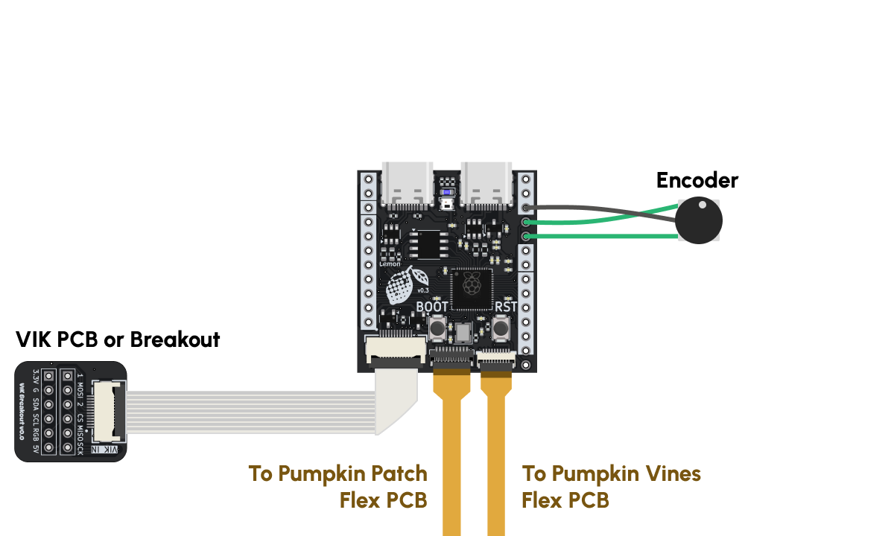
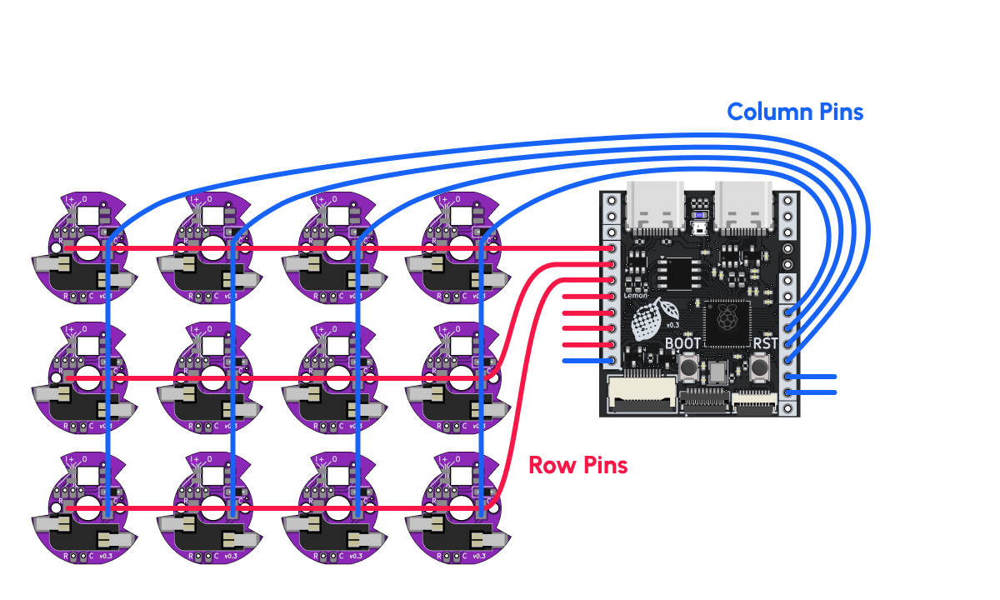
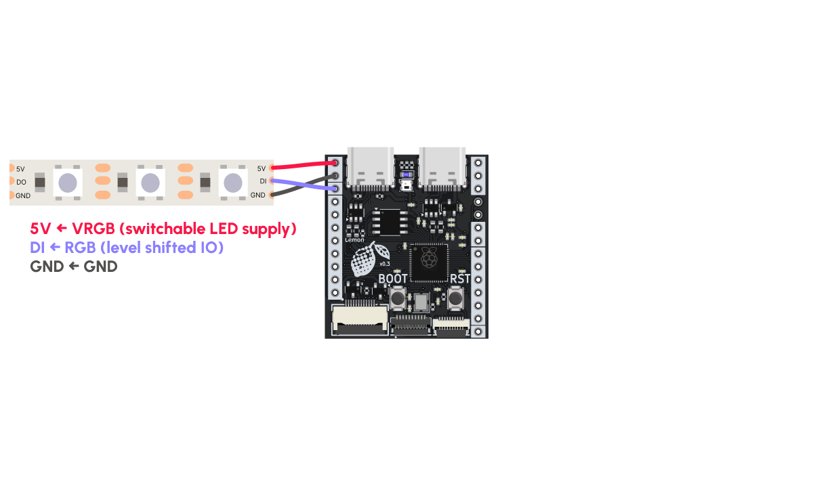
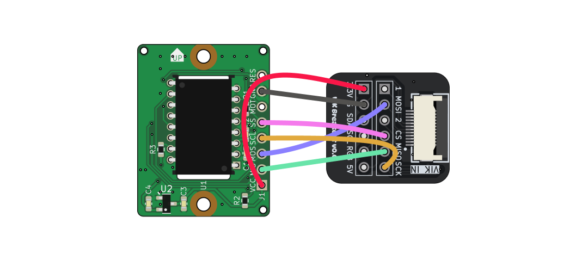

# Lemon Wired Microcontroller

The Lemon Wired is a RP2040-based microcontroller for split keyboards with two USB-C ports, a VIK connector, and two FPC connectors for connecting column-flex PCBs. If you use column-flex PCBs and VIK-compatible peripherals, it's possible to build a split keyboard without soldering any wires!

If you haven't already, I suggest you check out the [Lemon Landing page](https://ryanis.cool/cosmos/lemon/) to learn more.

--8<-- "docs/docs/pcbs/.shared/info.md"

## Pinout

Go to the [landing page](https://ryanis.cool/cosmos/lemon/) :)

## Wiring

### Recommended Use

I recommend using column-flex PCBs to wire your keys, not only because they are easy to connect via the FPC connectors on the bottom of the microcontroller, but also because you will save yourself hours of wiring together keys. This example shows the two I sell, the [Pumpkin Patch](https://ryanis.cool/cosmos/pumpkin/) (for upper keys & some thumb keys) and Pumpkin Vine (for the further away thumb keys), used to wire the keys as well as an encoder attached to the spare I/O pins.

> The Pumpkin Vine is not released yet, but you can buy [Skree Toe Beans](https://cosmos-store.ryanis.cool/products/skree-toe-beans) in the meantime from the Cosmos store as a substitute.

{width=600 .center}

???tip "Using More Than One Encoder?"

    You're crazy. Hahaha.

    The two pins the encoder is attached to, GP28 and GP29, are the only pins on the board not connectorized. If you need more encoders, you'll have to steal pins away from the other peripherals. Chances are you're not using *everything*, so some potential pins you can grab are, in order of ease of use:

    - GPIO26/GPIO27 (GP1 and GP2 for VIK): If you're not connecting anything with VIK, then you can use these as normal I/Os. Like GPIO28 and GPIO29, they can also read analog voltages!
    - Row and Column Pins: Unless you're using a 7x7 matrix, you'll probably have a few unused ones. Note that the Pumpkin Patch PCB uses up to R1–R6 and C1–C7, whereas the Pumpkin Vines PCB uses R7 and up to C1–C7.
    - All the VIK pins. If you have no reason to use VIK but need many, many more GPIOs, you can use the VIK breakout or a 12pin/0.5mm FPC breakout to access these pins. This gives you 8 more digital I/Os including GP1 and GP2. Don't use GPIO2 (RGB* in the wiring diagram) because it is level shifted up to 5V!

### Handwiring / Using Plum Twists

If you're forgoing flex PCBs, here's how you should solder the row and column wires to the microcontroller. Depending on the version your C7 might be in a different spot. Make sure to check the pinout!

{width=600 .center}

Chances are, your keyboard layout is not a rectangle. In that case make sure you have 7 columns and 7 rows max and that every key is assigned to a unique pair of row and column pins. It doesn't matter if you have 7 keys in one column and 3 in another.

By following my convention of which pins are for the rows and which are for the columns, you'll be able to use tools I develop like [PeaMK](https://github.com/rianadon/peaMK) to more quickly set up your firmware.

### Connecting RGB LED Strips

If you're handwiring and would like some backlighting on the keys but don't feel like spending another 3 hours soldering, RGB LED strips are a quick and easy alternative. I usually opt for the WS2812B ones, but QMK [supports a few WS28xx and SK68xx variants](https://docs.qmk.fm/drivers/ws2812).

{width=600 .center}

Once soldered, you can coil the LED strip up in the base of the keyboard. If you laser cut a transparent base plate or use transparent filament, you'll get really cool effects.

???tip "Combining an LED Strip and Per-Key RGB"

    If you're merely writing the LEDs with a constant color, you can use the RGB pin for diving an LED strip while running per-key LEDs off of the FPC connector or the RGB pin.

    However, if you are trying to run animations, the strip will copy whatever the keys do. If you'd like to run them independently, you will need to solder the strip's DI pin to the DO pin on the last per-key LED in the chain. Running the snake animation in QMK and seeing where the snake stops is a great way to figure out which one is the last one.

### VIK Breakout and Trackball

There are sadly no trackball PCBs with VIK connectors on the market. I'm working with TheBigSkree to fix this, but for now you will need augment one with a VIK breakout.

This example uses the [Ogen Lite PCB](https://github.com/Ariamelon/Ogen/tree/V1-Lite/PCB) (which Skree also [sells](https://skree.us/products/qmk-compatible-trackball-mouse-sensor-pmw3389-board-ogen-lite?ref=cosmos)) with a PMW3360/PMW3389. The wiring will be identical to the Joe's Sensors one I link in Cosmos. I recommend connecting the two with short cables so most of the distance is covered by the FPC connector. Your wiring will look much neater for it.

{width=600 .center}

<center class="pinout" markdown>

| Trackball PCB | VIK Breakout |
| :------------ | :----------- |
| VCC           | 3.3V         |
| MIS/MISO      | MISO         |
| MOS/MOSI      | MOSI         |
| SCL/SCK       | SCK          |
| SS            | CS           |
| MOT/MT        | n/a          |
| GND           | GND          |
| RES/RST       | n/a          |

</center>
--8<-- "docs/docs/pcbs/.shared/vik-wiring.md"

## Programming

Like other RP2040 microcontrollers, there are two ways to get the Lemon into bootloader mode so you can upload firmware:

- Hold the BOOT button down as you plug in the USB cable.
- With the USB cable already in, hold down BOOT, press and release RST, then release BOOT.

You'll see a removable drive called RPI-RP2 pop up on your computer. Drag your UF2 file into this folder, then wait for the microcontroller to reset itself and remove the drive.

!!!tip "MacOS Warnings"

    If you're uploading firmware from a Mac, you may get warnings saying that your computer couldn't sucessfully write to the drive or reminding you to eject the drive. This is normal and expected.

Once your microcontroller is sealed away in your keyboard, you won't be able to use the RST and BOOT buttons anymore. There are three ways of getting around this in QMK:

- (My Preference) Set up Bootmagic. If you hold down a certain key while plugging your keyboard in, the microcontroller will enter bootloader mode. You can configure which key this is per split side.
- Wire a physical reset button between the reset pin on the bottom right of the Lemon Wired and ground. You can use the custom connector option in Cosmos to make a hole for the button. Once you add `#!c #define RP2040_BOOTLOADER_DOUBLE_TAP_RESET` to your `config.h`, double tapping the reset button will enter bootloader mode.
- Don't add a bottom plate (or take it off), You'll be able to access the GND and RST pins through the channel in the Cosmos board holder. If you short these with tweezers or a jumper twice in quick succession with the above QMK changes added then you will be in bootloader mode.

If you're using Cosmos and peaMK to generate firmware for you, both of these are automatically set up in QMK.

## QMK Example

The best example of using QMK on the Lemon microcontroller will for now probably be the QMK implementation of my [peaMK](https://github.com/rianadon/peaMK/tree/main/qmk/keyboards/peamk_wired) software. Currently, all this program does is print the matrix position of a key you press, but you can disable this feature by editing `keymap.c`. There are a few noteworthy aspects to this program:

- It uses as much of the modern, data-driven QMK approach as possible.
- It relies on Sadek Baroudi's VIK library for QMK to enable quick setup of VIK modules.
- Communication is done through full-duplex UART.

When using QMK, you will need to wire the Link-only connector on this microcontroller to the Link-only connector on the other microcontroller.

### QMK Tips

1. Use full-duplex UART! Half-duplex will not work since its QMK implementation does not work with the inline resistors on the signal lines required for USB-C. Besides, full-duplex will be faster–[even the author of half-duplex driver recommends it](https://old.reddit.com/r/olkb/comments/18uf6nj/rp2040_split_keyboard_data_line_halfduplex_with/kinff4o/)!

   My recommended configuration for this is (in `config.h`):

   ```c
   #define SPLIT_USB_DETECT
   #define SERIAL_USART_FULL_DUPLEX
   #define SERIAL_USART_PIN_SWAP
   #define SERIAL_USART_TX_PIN GP0
   #define SERIAL_USART_RX_PIN GP1
   ```

2. Use `EE_HANDS` to determine handedness. It's really easy to use. Then use the commands in the [QMK on RP2040 guide](../qmk-rp2040.md#compiling-and-flashing) to flash and set handedness at the same time.

3. Speaking of [the guide](../qmk-rp2040.md), I recommend following it if you've never used QMK before. Even if you're autogenerating your firmware, it's good to skim it so you can an idea of what the different files in QMK do.

## KMK Example

Work in progress :) I'm working on merging my changes into CircuitPython and KMK.

So far KMK is the only keyboard firmware on which I've been able to use the right USB port as the link port.

## Arduino Core

I haven't contributed this board upstream yet since I don't know how popular this option is going to be. Therefore, if you do program the Lemon with Arduino then please tell me so I can prioritize this!

??? note "Expand Arduino Instructions (Caution: Not Easy)"

    Install Earle Philhower's [Pi Pico Core](https://arduino-pico.readthedocs.io/en/latest/install.html#installing-via-git) through git. If you've already installed it through the Arduino Board Manager, uninstall then install through git. Then, open the folder you've cloned and edit `boards.txt`. You'll want to add the following lines:
    ```
    # -----------------------------------
    # Cosmos Lemon Wired
    # -----------------------------------
    cosmos_lemon.name=Cosmos Lemon Wired
    cosmos_lemon.vid.0=0x0001
    cosmos_lemon.pid.0=0x8001
    cosmos_lemon.vid.1=0x0001
    cosmos_lemon.pid.1=0x8101
    cosmos_lemon.upload_port.0.vid=0x0001
    cosmos_lemon.upload_port.0.pid=0x8001
    cosmos_lemon.upload_port.1.vid=0x0001
    cosmos_lemon.upload_port.1.pid=0x8101
    cosmos_lemon.build.usbvid=-DUSBD_VID=0x001
    cosmos_lemon.build.usbpid=-DUSBD_PID=0x8001
    cosmos_lemon.build.usbpwr=-DUSBD_MAX_POWER_MA=250
    cosmos_lemon.build.board=COSMOS_LEMON_RP2040
    cosmos_lemon.build.mcu=cortex-m0plus
    cosmos_lemon.build.chip=rp2040
    cosmos_lemon.build.toolchain=arm-none-eabi
    cosmos_lemon.build.toolchainpkg=pqt-gcc
    cosmos_lemon.build.toolchainopts=-march=armv6-m -mcpu=cortex-m0plus -mthumb
    cosmos_lemon.build.uf2family=--family rp2040
    cosmos_lemon.build.variant=cosmos_lemon
    cosmos_lemon.upload.maximum_size=8388608
    cosmos_lemon.upload.wait_for_upload_port=true
    cosmos_lemon.upload.erase_cmd=
    cosmos_lemon.serial.disableDTR=false
    cosmos_lemon.serial.disableRTS=false
    cosmos_lemon.build.f_cpu=125000000
    cosmos_lemon.build.led=
    cosmos_lemon.build.core=rp2040
    cosmos_lemon.build.ldscript=memmap_default.ld
    cosmos_lemon.build.boot2=boot2_w25x10cl_4_padded_checksum
    cosmos_lemon.build.usb_manufacturer="Cosmos"
    cosmos_lemon.build.usb_product="Lemon Wired"
    cosmos_lemon.menu.flash.8388608_0=8MB (no FS)
    cosmos_lemon.menu.flash.8388608_0.upload.maximum_size=8384512
    cosmos_lemon.menu.flash.8388608_0.build.flash_total=8388608
    cosmos_lemon.menu.flash.8388608_0.build.flash_length=8384512
    cosmos_lemon.menu.flash.8388608_0.build.eeprom_start=276819968
    cosmos_lemon.menu.flash.8388608_0.build.fs_start=276819968
    cosmos_lemon.menu.flash.8388608_0.build.fs_end=276819968
    cosmos_lemon.menu.flash.8388608_65536=8MB (Sketch: 8128KB, FS: 64KB)
    cosmos_lemon.menu.flash.8388608_65536.upload.maximum_size=8318976
    cosmos_lemon.menu.flash.8388608_65536.build.flash_total=8388608
    cosmos_lemon.menu.flash.8388608_65536.build.flash_length=8318976
    cosmos_lemon.menu.flash.8388608_65536.build.eeprom_start=276819968
    cosmos_lemon.menu.flash.8388608_65536.build.fs_start=276754432
    cosmos_lemon.menu.flash.8388608_65536.build.fs_end=276819968
    cosmos_lemon.menu.flash.8388608_131072=8MB (Sketch: 8064KB, FS: 128KB)
    cosmos_lemon.menu.flash.8388608_131072.upload.maximum_size=8253440
    cosmos_lemon.menu.flash.8388608_131072.build.flash_total=8388608
    cosmos_lemon.menu.flash.8388608_131072.build.flash_length=8253440
    cosmos_lemon.menu.flash.8388608_131072.build.eeprom_start=276819968
    cosmos_lemon.menu.flash.8388608_131072.build.fs_start=276688896
    cosmos_lemon.menu.flash.8388608_131072.build.fs_end=276819968
    cosmos_lemon.menu.flash.8388608_262144=8MB (Sketch: 7936KB, FS: 256KB)
    cosmos_lemon.menu.flash.8388608_262144.upload.maximum_size=8122368
    cosmos_lemon.menu.flash.8388608_262144.build.flash_total=8388608
    cosmos_lemon.menu.flash.8388608_262144.build.flash_length=8122368
    cosmos_lemon.menu.flash.8388608_262144.build.eeprom_start=276819968
    cosmos_lemon.menu.flash.8388608_262144.build.fs_start=276557824
    cosmos_lemon.menu.flash.8388608_262144.build.fs_end=276819968
    cosmos_lemon.menu.flash.8388608_524288=8MB (Sketch: 7680KB, FS: 512KB)
    cosmos_lemon.menu.flash.8388608_524288.upload.maximum_size=7860224
    cosmos_lemon.menu.flash.8388608_524288.build.flash_total=8388608
    cosmos_lemon.menu.flash.8388608_524288.build.flash_length=7860224
    cosmos_lemon.menu.flash.8388608_524288.build.eeprom_start=276819968
    cosmos_lemon.menu.flash.8388608_524288.build.fs_start=276295680
    cosmos_lemon.menu.flash.8388608_524288.build.fs_end=276819968
    cosmos_lemon.menu.flash.8388608_1048576=8MB (Sketch: 7MB, FS: 1MB)
    cosmos_lemon.menu.flash.8388608_1048576.upload.maximum_size=7335936
    cosmos_lemon.menu.flash.8388608_1048576.build.flash_total=8388608
    cosmos_lemon.menu.flash.8388608_1048576.build.flash_length=7335936
    cosmos_lemon.menu.flash.8388608_1048576.build.eeprom_start=276819968
    cosmos_lemon.menu.flash.8388608_1048576.build.fs_start=275771392
    cosmos_lemon.menu.flash.8388608_1048576.build.fs_end=276819968
    cosmos_lemon.menu.flash.8388608_2097152=8MB (Sketch: 6MB, FS: 2MB)
    cosmos_lemon.menu.flash.8388608_2097152.upload.maximum_size=6287360
    cosmos_lemon.menu.flash.8388608_2097152.build.flash_total=8388608
    cosmos_lemon.menu.flash.8388608_2097152.build.flash_length=6287360
    cosmos_lemon.menu.flash.8388608_2097152.build.eeprom_start=276819968
    cosmos_lemon.menu.flash.8388608_2097152.build.fs_start=274722816
    cosmos_lemon.menu.flash.8388608_2097152.build.fs_end=276819968
    cosmos_lemon.menu.flash.8388608_3145728=8MB (Sketch: 5MB, FS: 3MB)
    cosmos_lemon.menu.flash.8388608_3145728.upload.maximum_size=5238784
    cosmos_lemon.menu.flash.8388608_3145728.build.flash_total=8388608
    cosmos_lemon.menu.flash.8388608_3145728.build.flash_length=5238784
    cosmos_lemon.menu.flash.8388608_3145728.build.eeprom_start=276819968
    cosmos_lemon.menu.flash.8388608_3145728.build.fs_start=273674240
    cosmos_lemon.menu.flash.8388608_3145728.build.fs_end=276819968
    cosmos_lemon.menu.flash.8388608_4194304=8MB (Sketch: 4MB, FS: 4MB)
    cosmos_lemon.menu.flash.8388608_4194304.upload.maximum_size=4190208
    cosmos_lemon.menu.flash.8388608_4194304.build.flash_total=8388608
    cosmos_lemon.menu.flash.8388608_4194304.build.flash_length=4190208
    cosmos_lemon.menu.flash.8388608_4194304.build.eeprom_start=276819968
    cosmos_lemon.menu.flash.8388608_4194304.build.fs_start=272625664
    cosmos_lemon.menu.flash.8388608_4194304.build.fs_end=276819968
    cosmos_lemon.menu.flash.8388608_5242880=8MB (Sketch: 3MB, FS: 5MB)
    cosmos_lemon.menu.flash.8388608_5242880.upload.maximum_size=3141632
    cosmos_lemon.menu.flash.8388608_5242880.build.flash_total=8388608
    cosmos_lemon.menu.flash.8388608_5242880.build.flash_length=3141632
    cosmos_lemon.menu.flash.8388608_5242880.build.eeprom_start=276819968
    cosmos_lemon.menu.flash.8388608_5242880.build.fs_start=271577088
    cosmos_lemon.menu.flash.8388608_5242880.build.fs_end=276819968
    cosmos_lemon.menu.flash.8388608_6291456=8MB (Sketch: 2MB, FS: 6MB)
    cosmos_lemon.menu.flash.8388608_6291456.upload.maximum_size=2093056
    cosmos_lemon.menu.flash.8388608_6291456.build.flash_total=8388608
    cosmos_lemon.menu.flash.8388608_6291456.build.flash_length=2093056
    cosmos_lemon.menu.flash.8388608_6291456.build.eeprom_start=276819968
    cosmos_lemon.menu.flash.8388608_6291456.build.fs_start=270528512
    cosmos_lemon.menu.flash.8388608_6291456.build.fs_end=276819968
    cosmos_lemon.menu.flash.8388608_7340032=8MB (Sketch: 1MB, FS: 7MB)
    cosmos_lemon.menu.flash.8388608_7340032.upload.maximum_size=1044480
    cosmos_lemon.menu.flash.8388608_7340032.build.flash_total=8388608
    cosmos_lemon.menu.flash.8388608_7340032.build.flash_length=1044480
    cosmos_lemon.menu.flash.8388608_7340032.build.eeprom_start=276819968
    cosmos_lemon.menu.flash.8388608_7340032.build.fs_start=269479936
    cosmos_lemon.menu.flash.8388608_7340032.build.fs_end=276819968
    cosmos_lemon.menu.freq.200=200 MHz
    cosmos_lemon.menu.freq.200.build.f_cpu=200000000L
    cosmos_lemon.menu.freq.50=50 MHz
    cosmos_lemon.menu.freq.50.build.f_cpu=50000000L
    cosmos_lemon.menu.freq.100=100 MHz
    cosmos_lemon.menu.freq.100.build.f_cpu=100000000L
    cosmos_lemon.menu.freq.120=120 MHz
    cosmos_lemon.menu.freq.120.build.f_cpu=120000000L
    cosmos_lemon.menu.freq.125=125 MHz
    cosmos_lemon.menu.freq.125.build.f_cpu=125000000L
    cosmos_lemon.menu.freq.128=128 MHz
    cosmos_lemon.menu.freq.128.build.f_cpu=128000000L
    cosmos_lemon.menu.freq.133=133 MHz
    cosmos_lemon.menu.freq.133.build.f_cpu=133000000L
    cosmos_lemon.menu.freq.150=150 MHz
    cosmos_lemon.menu.freq.150.build.f_cpu=150000000L
    cosmos_lemon.menu.freq.176=176 MHz
    cosmos_lemon.menu.freq.176.build.f_cpu=176000000L
    cosmos_lemon.menu.freq.225=225 MHz (Overclock)
    cosmos_lemon.menu.freq.225.build.f_cpu=225000000L
    cosmos_lemon.menu.freq.240=240 MHz (Overclock)
    cosmos_lemon.menu.freq.240.build.f_cpu=240000000L
    cosmos_lemon.menu.freq.250=250 MHz (Overclock)
    cosmos_lemon.menu.freq.250.build.f_cpu=250000000L
    cosmos_lemon.menu.freq.276=276 MHz (Overclock)
    cosmos_lemon.menu.freq.276.build.f_cpu=276000000L
    cosmos_lemon.menu.freq.300=300 MHz (Overclock)
    cosmos_lemon.menu.freq.300.build.f_cpu=300000000L
    cosmos_lemon.menu.opt.Small=Small (-Os) (standard)
    cosmos_lemon.menu.opt.Small.build.flags.optimize=-Os
    cosmos_lemon.menu.opt.Optimize=Optimize (-O)
    cosmos_lemon.menu.opt.Optimize.build.flags.optimize=-O
    cosmos_lemon.menu.opt.Optimize2=Optimize More (-O2)
    cosmos_lemon.menu.opt.Optimize2.build.flags.optimize=-O2
    cosmos_lemon.menu.opt.Optimize3=Optimize Even More (-O3)
    cosmos_lemon.menu.opt.Optimize3.build.flags.optimize=-O3
    cosmos_lemon.menu.opt.Fast=Fast (-Ofast) (maybe slower)
    cosmos_lemon.menu.opt.Fast.build.flags.optimize=-Ofast
    cosmos_lemon.menu.opt.Debug=Debug (-Og)
    cosmos_lemon.menu.opt.Debug.build.flags.optimize=-Og
    cosmos_lemon.menu.opt.Disabled=Disabled (-O0)
    cosmos_lemon.menu.opt.Disabled.build.flags.optimize=-O0
    cosmos_lemon.menu.profile.Disabled=Disabled
    cosmos_lemon.menu.profile.Disabled.build.flags.profile=
    cosmos_lemon.menu.profile.Enabled=Enabled
    cosmos_lemon.menu.profile.Enabled.build.flags.profile=-pg -D__PROFILE
    cosmos_lemon.menu.rtti.Disabled=Disabled
    cosmos_lemon.menu.rtti.Disabled.build.flags.rtti=-fno-rtti
    cosmos_lemon.menu.rtti.Enabled=Enabled
    cosmos_lemon.menu.rtti.Enabled.build.flags.rtti=
    cosmos_lemon.menu.stackprotect.Disabled=Disabled
    cosmos_lemon.menu.stackprotect.Disabled.build.flags.stackprotect=
    cosmos_lemon.menu.stackprotect.Enabled=Enabled
    cosmos_lemon.menu.stackprotect.Enabled.build.flags.stackprotect=-fstack-protector
    cosmos_lemon.menu.exceptions.Disabled=Disabled
    cosmos_lemon.menu.exceptions.Disabled.build.flags.exceptions=-fno-exceptions
    cosmos_lemon.menu.exceptions.Disabled.build.flags.libstdcpp=-lstdc++
    cosmos_lemon.menu.exceptions.Enabled=Enabled
    cosmos_lemon.menu.exceptions.Enabled.build.flags.exceptions=-fexceptions
    cosmos_lemon.menu.exceptions.Enabled.build.flags.libstdcpp=-lstdc++-exc
    cosmos_lemon.menu.dbgport.Disabled=Disabled
    cosmos_lemon.menu.dbgport.Disabled.build.debug_port=
    cosmos_lemon.menu.dbgport.Serial=Serial
    cosmos_lemon.menu.dbgport.Serial.build.debug_port=-DDEBUG_RP2040_PORT=Serial
    cosmos_lemon.menu.dbgport.Serial1=Serial1
    cosmos_lemon.menu.dbgport.Serial1.build.debug_port=-DDEBUG_RP2040_PORT=Serial1
    cosmos_lemon.menu.dbgport.Serial2=Serial2
    cosmos_lemon.menu.dbgport.Serial2.build.debug_port=-DDEBUG_RP2040_PORT=Serial2
    cosmos_lemon.menu.dbgport.SerialSemi=SerialSemi
    cosmos_lemon.menu.dbgport.SerialSemi.build.debug_port=-DDEBUG_RP2040_PORT=SerialSemi
    cosmos_lemon.menu.dbglvl.None=None
    cosmos_lemon.menu.dbglvl.None.build.debug_level=
    cosmos_lemon.menu.dbglvl.Core=Core
    cosmos_lemon.menu.dbglvl.Core.build.debug_level=-DDEBUG_RP2040_CORE
    cosmos_lemon.menu.dbglvl.SPI=SPI
    cosmos_lemon.menu.dbglvl.SPI.build.debug_level=-DDEBUG_RP2040_SPI
    cosmos_lemon.menu.dbglvl.Wire=Wire
    cosmos_lemon.menu.dbglvl.Wire.build.debug_level=-DDEBUG_RP2040_WIRE
    cosmos_lemon.menu.dbglvl.Bluetooth=Bluetooth
    cosmos_lemon.menu.dbglvl.Bluetooth.build.debug_level=-DDEBUG_RP2040_BLUETOOTH
    cosmos_lemon.menu.dbglvl.All=All
    cosmos_lemon.menu.dbglvl.All.build.debug_level=-DDEBUG_RP2040_WIRE -DDEBUG_RP2040_SPI -DDEBUG_RP2040_CORE -DDEBUG_RP2040_BLUETOOTH
    cosmos_lemon.menu.dbglvl.NDEBUG=NDEBUG
    cosmos_lemon.menu.dbglvl.NDEBUG.build.debug_level=-DNDEBUG
    cosmos_lemon.menu.usbstack.picosdk=Pico SDK
    cosmos_lemon.menu.usbstack.picosdk.build.usbstack_flags=
    cosmos_lemon.menu.usbstack.tinyusb=Adafruit TinyUSB
    cosmos_lemon.menu.usbstack.tinyusb.build.usbstack_flags=-DUSE_TINYUSB "-I{runtime.platform.path}/libraries/Adafruit_TinyUSB_Arduino/src/arduino"
    cosmos_lemon.menu.usbstack.tinyusb_host=Adafruit TinyUSB Host (native)
    cosmos_lemon.menu.usbstack.tinyusb_host.build.usbstack_flags=-DUSE_TINYUSB -DUSE_TINYUSB_HOST "-I{runtime.platform.path}/libraries/Adafruit_TinyUSB_Arduino/src/arduino"
    cosmos_lemon.menu.usbstack.nousb=No USB
    cosmos_lemon.menu.usbstack.nousb.build.usbstack_flags="-DNO_USB -DDISABLE_USB_SERIAL -I{runtime.platform.path}/tools/libpico"
    cosmos_lemon.menu.ipbtstack.ipv4only=IPv4 Only
    cosmos_lemon.menu.ipbtstack.ipv4only.build.libpicow=libipv4.a
    cosmos_lemon.menu.ipbtstack.ipv4only.build.libpicowdefs=-DLWIP_IPV6=0 -DLWIP_IPV4=1
    cosmos_lemon.menu.ipbtstack.ipv4ipv6=IPv4 + IPv6
    cosmos_lemon.menu.ipbtstack.ipv4ipv6.build.libpicow=libipv4-ipv6.a
    cosmos_lemon.menu.ipbtstack.ipv4ipv6.build.libpicowdefs=-DLWIP_IPV6=1 -DLWIP_IPV4=1
    cosmos_lemon.menu.ipbtstack.ipv4btcble=IPv4 + Bluetooth
    cosmos_lemon.menu.ipbtstack.ipv4btcble.build.libpicow=libipv4-bt.a
    cosmos_lemon.menu.ipbtstack.ipv4btcble.build.libpicowdefs=-DLWIP_IPV6=0 -DLWIP_IPV4=1 -DENABLE_CLASSIC=1 -DENABLE_BLE=1
    cosmos_lemon.menu.ipbtstack.ipv4ipv6btcble=IPv4 + IPv6 + Bluetooth
    cosmos_lemon.menu.ipbtstack.ipv4ipv6btcble.build.libpicow=libipv4-ipv6-bt.a
    cosmos_lemon.menu.ipbtstack.ipv4ipv6btcble.build.libpicowdefs=-DLWIP_IPV6=1 -DLWIP_IPV4=1 -DENABLE_CLASSIC=1 -DENABLE_BLE=1
    cosmos_lemon.menu.ipbtstack.ipv4onlybig=IPv4 Only - 32K
    cosmos_lemon.menu.ipbtstack.ipv4onlybig.build.libpicow=libipv4-big.a
    cosmos_lemon.menu.ipbtstack.ipv4onlybig.build.libpicowdefs=-DLWIP_IPV6=0 -DLWIP_IPV4=1 -D__LWIP_MEMMULT=2
    cosmos_lemon.menu.ipbtstack.ipv4ipv6big=IPv4 + IPv6 - 32K
    cosmos_lemon.menu.ipbtstack.ipv4ipv6big.build.libpicow=libipv4-ipv6-big.a
    cosmos_lemon.menu.ipbtstack.ipv4ipv6big.build.libpicowdefs=-DLWIP_IPV6=1 -DLWIP_IPV4=1 -D__LWIP_MEMMULT=2
    cosmos_lemon.menu.ipbtstack.ipv4btcblebig=IPv4 + Bluetooth - 32K
    cosmos_lemon.menu.ipbtstack.ipv4btcblebig.build.libpicow=libipv4-bt-big.a
    cosmos_lemon.menu.ipbtstack.ipv4btcblebig.build.libpicowdefs=-DLWIP_IPV6=0 -DLWIP_IPV4=1 -DENABLE_CLASSIC=1 -DENABLE_BLE=1 -D__LWIP_MEMMULT=2
    cosmos_lemon.menu.ipbtstack.ipv4ipv6btcblebig=IPv4 + IPv6 + Bluetooth - 32K
    cosmos_lemon.menu.ipbtstack.ipv4ipv6btcblebig.build.libpicow=libipv4-ipv6-bt-big.a
    cosmos_lemon.menu.ipbtstack.ipv4ipv6btcblebig.build.libpicowdefs=-DLWIP_IPV6=1 -DLWIP_IPV4=1 -DENABLE_CLASSIC=1 -DENABLE_BLE=1 -D__LWIP_MEMMULT=2
    cosmos_lemon.menu.uploadmethod.default=Default (UF2)
    cosmos_lemon.menu.uploadmethod.default.build.ram_length=256k
    cosmos_lemon.menu.uploadmethod.default.build.debugscript=picoprobe_cmsis_dap.tcl
    cosmos_lemon.menu.uploadmethod.default.upload.maximum_data_size=262144
    cosmos_lemon.menu.uploadmethod.default.upload.tool=uf2conv
    cosmos_lemon.menu.uploadmethod.default.upload.tool.default=uf2conv
    cosmos_lemon.menu.uploadmethod.default.upload.tool.network=uf2conv-network
    cosmos_lemon.menu.uploadmethod.picotool=Picotool
    cosmos_lemon.menu.uploadmethod.picotool.build.ram_length=256k
    cosmos_lemon.menu.uploadmethod.picotool.build.debugscript=picoprobe.tcl
    cosmos_lemon.menu.uploadmethod.picotool.build.picodebugflags=-DENABLE_PICOTOOL_USB
    cosmos_lemon.menu.uploadmethod.picotool.upload.maximum_data_size=262144
    cosmos_lemon.menu.uploadmethod.picotool.upload.tool=picotool
    cosmos_lemon.menu.uploadmethod.picotool.upload.tool.default=picotool
    cosmos_lemon.menu.uploadmethod.picoprobe_cmsis_dap=Picoprobe/Debugprobe (CMSIS-DAP)
    cosmos_lemon.menu.uploadmethod.picoprobe_cmsis_dap.build.ram_length=256k
    cosmos_lemon.menu.uploadmethod.picoprobe_cmsis_dap.build.debugscript=picoprobe_cmsis_dap.tcl
    cosmos_lemon.menu.uploadmethod.picoprobe_cmsis_dap.upload.maximum_data_size=262144
    cosmos_lemon.menu.uploadmethod.picoprobe_cmsis_dap.upload.tool=picoprobe_cmsis_dap
    cosmos_lemon.menu.uploadmethod.picoprobe_cmsis_dap.upload.tool.default=picoprobe_cmsis_dap
    ```

    Then inside the `variants` directory create a folder named `cosmos_lemon`. Then add a file called `pins_arduino.h` inside:

    ```cpp title="variants/cosmos_lemon/pins_arduino.h"
    #pragma once

    // LEDs
    #define PIN_LED        (13u)

    // NeoPixel
    #define PIN_NEOPIXEL   (16u)

    // Serial
    #define PIN_SERIAL1_TX (0u)
    #define PIN_SERIAL1_RX (1u)

    // Not pinned out
    #define PIN_SERIAL2_TX (31u)
    #define PIN_SERIAL2_RX (31u)

    // SPI
    #define PIN_SPI0_MISO  (20u)
    #define PIN_SPI0_MOSI  (19u)
    #define PIN_SPI0_SCK   (18u)
    #define PIN_SPI0_SS    (17u)

    // Not pinned out
    #define PIN_SPI1_MISO  (31u)
    #define PIN_SPI1_MOSI  (31u)
    #define PIN_SPI1_SCK   (31u)
    #define PIN_SPI1_SS    (31u)

    // Wire
    #define __WIRE0_DEVICE i2c1
    #define PIN_WIRE0_SDA  (2u)
    #define PIN_WIRE0_SCL  (3u)
    #define __WIRE1_DEVICE i2c0
    #define PIN_WIRE1_SDA  (24u)
    #define PIN_WIRE1_SCL  (25u)

    #define SERIAL_HOWMANY (2u)
    #define SPI_HOWMANY    (1u)
    #define WIRE_HOWMANY   (1u)

    // D pins
    #define __PIN_D4             (6u)
    #define __PIN_D5             (7u)
    #define __PIN_D6             (8u)

    #include "../generic/common.h"
    ```

    After modifying these files, restart Arduino IDE. You should now see Cosmos Lemon Wired listed as the last option when choosing a board through **Tools -> Board -> Raspberry Pi Pico -> Cosmos Lemon Wireled**.

--8<-- "docs/docs/pcbs/.shared/vik.md"

## Breadboard and Headers

I don't recommend using headers or sockets with Cosmos, ever.

However, if you want to do some prototyping or found a use for the microcontroller outside your keyboard, the microcontroller will fit in a breadboard using standard 2.54mm/100mils pitch pin headers, but it will take up the entire width of the breadboard and leave no space to the side for pins! I recommend either straddling it across two breadboards or using preformed jumper wire underneath (the kind that stays really flat and neat) to bring the pins you need to somewhere accessible.

## PCB Drawing and Dimensions

{ width=500 .center }

## Further Documentation

Documentation for older boards, schematics and layout, and more can be found on the Wired Lemon's [GitHub page](https://github.com/rianadon/Cosmos-Keyboard-PCBs/tree/main/lemon-microcontroller).
