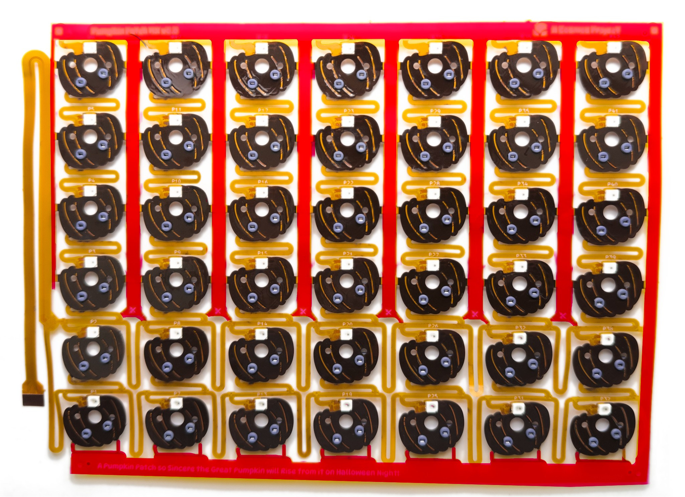
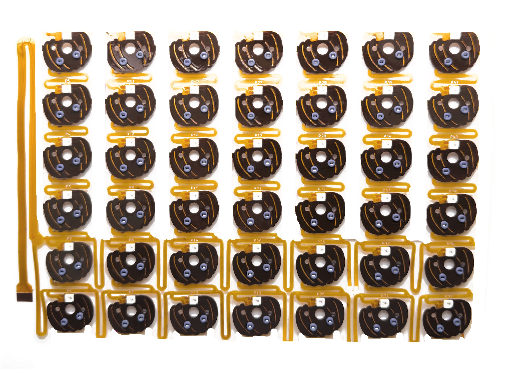

# Pumpkin Patch PCB

The Pumpkin Patch PCB is a flexible circuit board complete with diodes and RGB LEDs to connect your keyboard's switches to your chosen microcontroller with minimal soldering.

If you haven't already, I suggest you check out the [Pumpkin Landing page](https://ryanis.cool/cosmos/pumpkin/) to see it in action.

## Specifications

### Spacing

The PCBs naturally rest at a 20mm vertical spacing and 24mm horizontal spacing. You can compress them to a minimum of 16mm vertically by 18.5mm horizontally or stretch them vertically to a whopping 42mm between centers, more than double their resting length! Each pumpkin is connected with a thin strip of polyimide and copper, so there is little resistance even at full stretch.

The bottom 2 rows are connected with polyimide as well, enabling a maximum horizontal stretch of 50mm. The other rows have no restriction.

### Sizing

The PCBs are wired under the assumption that every column will have at least 2 keys (so that both rows of vines are always used). The only situation where you can use only the bottom vine is if you 1) have 4 or fewer columns and 2) will not use the LEDs. For such extremely small boards, the [Plum Twists](https://ryanis.cool/cosmos/plum-twist/) or directly soldering to the switches are a better fit.

If you are using this PCB together with a PCB for the thumb cluster, you will either have to use all 7 columns or solder a jumper wire onto the LEDs themselves. This will be fixed in future revisions.

## Cutting

!!!warning "Pay Attention!"
This is the trickiest part–not because it's difficult to make the cuts, but because if you cut the wrong thing you will break your PCB! Be careful that if you are using scissors, you do not cut part where you intend.

The PCBs come attached in sheets so that everything stays together during shipping. The first step to using them is cutting out all the areas marked in red in this image.

Afterwards, the PCB should look like this (pardon my bad photoshopping–I'll get a better picture my next build).

As you cut everything out, it will become easy for the circuit to tangle itself. If you know the size to which you will cut each of your columns, I recommend you do some pruning first so it is easier to handle.

## Installation

With the switches already inserted, plug in the Pumpkin Patch from the rear. Also plug it into the FPC connector on your microcontroller.

Trim off any remaining unused Pumpkins. For columns that you cut down, there will be a solder jumpers on the tops of the columns that you cut. Solder these so that data signals can correctly flow from the LEDs on one column to the next. In the example below the jumpers are highlighted in green.

{ width=500 .center }
